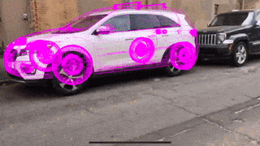
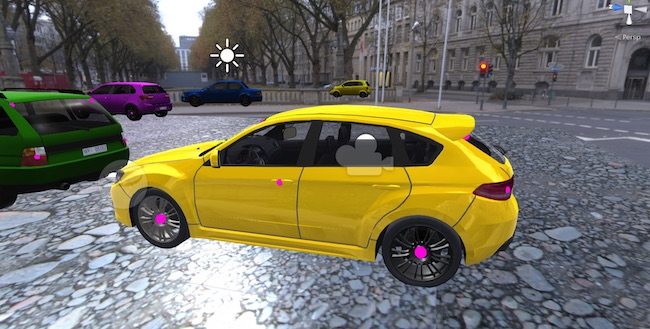

# Real-time Mobile Car Pose Estimation with CoreML 

Small demo of real-time car pose estimation using CoreML trained with synthetic data. 

We used Unity to generate the sythetic car dataset, read more about the project [here](https://medium.com/@laanlabs/real-time-3d-car-pose-estimation-trained-on-synthetic-data-5fa4a2c16634)

### NOTE: 
This model was only trained to handle a specific car model from a fixed viewing distance + angle range. It does work on similar car models, but the pose fit won't match up in 3d space as well. 

Requires [GitLFS](https://git-lfs.github.com/) to download OpenCV framework.

Snapshot of the Unity project:

